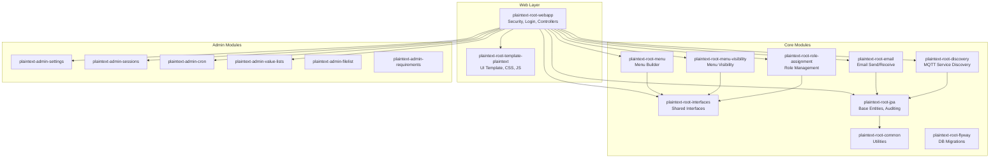

# Plaintext Root

[](https://github.com/daniel-marthaler/plaintext-root/actions/workflows/build-deploy.yaml)
[](https://opensource.org/licenses/MPL-2.0)
[](https://openjdk.org/)
[](https://spring.io/projects/spring-boot)
[](https://www.primefaces.org/)
[](#code-coverage)

**Plaintext Root** is an open-source application framework for rapidly building multi-tenant web applications with Jakarta Faces (JSF), PrimeFaces, and Spring Boot. It provides a complete foundation including security, navigation, admin panels, user management, and a pluggable template system — so you can focus on your business logic.

## Key Features

- **Multi-Tenancy** — Built-in mandate system for data isolation between tenants
- **Security** — Spring Security with role-based access control (User/Admin/Root), CSRF protection, session tracking
- **Menu System** — Annotation-driven menu builder with role-based visibility and badge support
- **Admin Panels** — Pre-built admin modules for settings, sessions, cron jobs, emails, and more
- **Template System** — Swappable UI templates (open-source Plaintext template included)
- **Discovery** — MQTT-based service discovery for connecting multiple Plaintext applications
- **Email** — Complete email send/receive system with IMAP and SMTP support
- **API Tokens** — Token-based REST API authentication
- **Cron Jobs** — Annotation-driven scheduled task system with monitoring UI
- **User Preferences** — Persistent theme, layout, and UI preferences per user

## Architecture



## Module Overview

| Module | Description |
|--------|-------------|
| `plaintext-root-interfaces` | Shared interfaces for security, settings, menu visibility |
| `plaintext-root-common` | Common utilities, XStream serialization, object storage |
| `plaintext-root-jpa` | Base JPA entities with audit fields, generic repositories |
| `plaintext-root-menu` | Annotation-driven menu system with hierarchical support |
| `plaintext-root-menu-visibility` | Mandate-based menu visibility control |
| `plaintext-root-role-assignment` | User role assignment and management |
| `plaintext-root-email` | Email send (SMTP) and receive (IMAP) with configuration UI |
| `plaintext-root-flyway` | Database migration management |
| `plaintext-root-discovery` | MQTT-based service discovery between Plaintext apps |
| `plaintext-root-webapp` | Main web application with security, login, and controllers |
| `plaintext-root-template-plaintext` | Open-source UI template (no commercial dependencies) |
| `plaintext-admin-settings` | Application settings management UI |
| `plaintext-admin-sessions` | Active session monitoring and insights |
| `plaintext-admin-cron` | Cron job monitoring and management UI |
| `plaintext-admin-value-lists` | Key-value list management (lookup tables) |
| `plaintext-admin-filelist` | File management module |
| `plaintext-admin-requirements` | Requirements management with AI integration |

## Tech Stack

| Technology | Version | Purpose |
|-----------|---------|---------|
| Java | 25 | Language |
| Spring Boot | 3.5.11 | Application framework |
| Jakarta Faces | 4.1.4 | UI component framework |
| PrimeFaces | 15.0.10 | JSF component library |
| JoinFaces | 5.5.8 | Spring Boot + JSF integration |
| PostgreSQL | 18+ | Database |
| Flyway | — | Database migrations |
| Lombok | 1.18.44 | Boilerplate reduction |
| Eclipse Mosquitto | — | MQTT broker (for Discovery) |

## Quick Start

### Prerequisites

- **Java 25+** (e.g., via [SDKMAN](https://sdkman.io/): `sdk install java 25-open`)
- **Maven 3.9+**
- **Docker** or **Podman** (optional, only for PostgreSQL)

### 1. Clone and Build

```bash
git clone https://github.com/daniel-marthaler/plaintext-root.git
cd plaintext-root

# Build all modules (no database needed!)
mvn clean install -DskipTests
```

### 2. Run the Application

```bash
mvn spring-boot:run -pl plaintext-root-webapp
```

The application starts at **http://localhost:8080** with an **in-memory H2 database** (PostgreSQL compatibility mode). No external database setup needed!

> **Note:** Data is lost on restart with H2. For persistent storage, switch to PostgreSQL (see below).

### 3. Switch to PostgreSQL (Optional)

For production or persistent data, switch to PostgreSQL:

```bash
# Start PostgreSQL
docker compose up -d

# Run with PostgreSQL profile
mvn spring-boot:run -pl plaintext-root-webapp -Dspring-boot.run.profiles=postgres
```

Or set the environment variable:
```bash
SPRING_PROFILES_ACTIVE=postgres mvn spring-boot:run -pl plaintext-root-webapp
```

### 4. H2 Console

In dev mode, the H2 database console is available at **http://localhost:8080/h2-console** with:
- JDBC URL: `jdbc:h2:mem:plaintext_root`
- Username: `sa`
- Password: *(empty)*

## Multi-Tenancy

Plaintext Root has built-in multi-tenancy support through the **mandate** system:

- Each user is assigned to a mandate (tenant)
- Data is isolated per mandate at the application level
- Menu visibility can be controlled per mandate
- Root users can switch between mandates at runtime
- The `SuperModel` base entity automatically tags records with the current mandate

## Menu System

Menus are defined as Spring beans using the `MenuItemImpl` class:

```java
@Component
public class MyMenu extends MenuItemImpl {
    public MyMenu() {
        setTitle("My Feature");
        setParent("Admin");           // Parent menu item
        setCommand("myfeature.xhtml"); // Target page
        setIcon("pi pi-star");         // PrimeIcons icon
        setOrder(100);                 // Sort order
        setRoles(List.of("ROLE_ADMIN")); // Required roles
    }
}
```

Menus are automatically discovered, sorted, and rendered with role-based visibility.

## Template System

The UI template is a separate Maven module that can be swapped:

```xml
<!-- Open-source template (default) -->
<dependency>
    <groupId>ch.plaintext</groupId>
    <artifactId>plaintext-root-template-plaintext</artifactId>
</dependency>
```

The template provides: layout CSS (light/dark), navigation JavaScript, XHTML templates (topbar, sidebar, config panel, footer), and theme color overrides.

### Features

- **Light/Dark mode** with persistent preference
- **Three menu layouts**: Sidebar, Horizontal, Slim
- **Color themes**: Blue, Green, Orange, Turquoise, Avocado, Purple, Red, Yellow
- **Input styles**: Outlined or Filled
- **Responsive** design with mobile sidebar

## Discovery

Multiple Plaintext applications can discover each other via MQTT:

```yaml
discovery:
  enabled: true
  app:
    id: my-app
    name: My Application
  mqtt:
    broker: tcp://mqtt-broker:1883
```

Connected apps appear in the globe icon dropdown in the topbar, enabling single-click navigation between applications.

## Database Migrations

Flyway migrations use H2 (PostgreSQL mode) compatible SQL syntax and are located in each module's `src/main/resources/db/migration/` directory. Migration file names follow the pattern:

```
V{timestamp}__description.sql
```

Generate timestamps with the included script (calculates seconds since 2000 and checks for conflicts).

## Security Roles

| Role | Description |
|------|-------------|
| `ROLE_USER` | Standard user access |
| `ROLE_ADMIN` | User management, admin panels |
| `ROLE_ROOT` | Full access, mandate switching, discovery stats |

## Project Structure

```
plaintext-root/
├── plaintext-root-interfaces/          # Shared interfaces
├── plaintext-root-common/              # Utilities
├── plaintext-root-jpa/                 # Base JPA entities
├── plaintext-root-menu/                # Menu builder
├── plaintext-root-menu-visibility/      # Menu visibility
├── plaintext-root-role-assignment/     # Role management
├── plaintext-root-email/               # Email system
├── plaintext-root-flyway/              # DB migrations
├── plaintext-root-discovery/           # MQTT discovery
├── plaintext-root-template-plaintext/  # Open-source UI template
├── plaintext-root-webapp/              # Main web application
├── plaintext-admin-settings/           # Settings admin
├── plaintext-admin-sessions/           # Session monitoring
├── plaintext-admin-cron/               # Cron job admin
├── plaintext-admin-value-lists/        # Lookup tables
├── plaintext-admin-filelist/           # File management
├── plaintext-admin-requirements/      # Requirements + AI
├── compose.yaml                        # PostgreSQL dev setup
├── Dockerfile                          # Production container
└── LICENSE                             # MPL 2.0
```

## Contributing

See [CONTRIBUTING.md](CONTRIBUTING.md) for guidelines on how to contribute.

## Code Coverage

Coverage reports are generated with [JaCoCo](https://www.jacoco.org/) during `mvn test`. Reports are available in each module's `target/site/jacoco/` directory.

```bash
# Run tests with coverage
mvn clean test

# Open report (example for webapp module)
open plaintext-root-webapp/target/site/jacoco/index.html
```

Coverage reports are also uploaded as artifacts in the [CI pipeline](https://github.com/daniel-marthaler/plaintext-root/actions).

## License

This project is licensed under the [Mozilla Public License 2.0](LICENSE).

All Java source files include the MPL 2.0 header. Third-party libraries (PrimeFlex, PrimeIcons, marked.js) are MIT-licensed.
