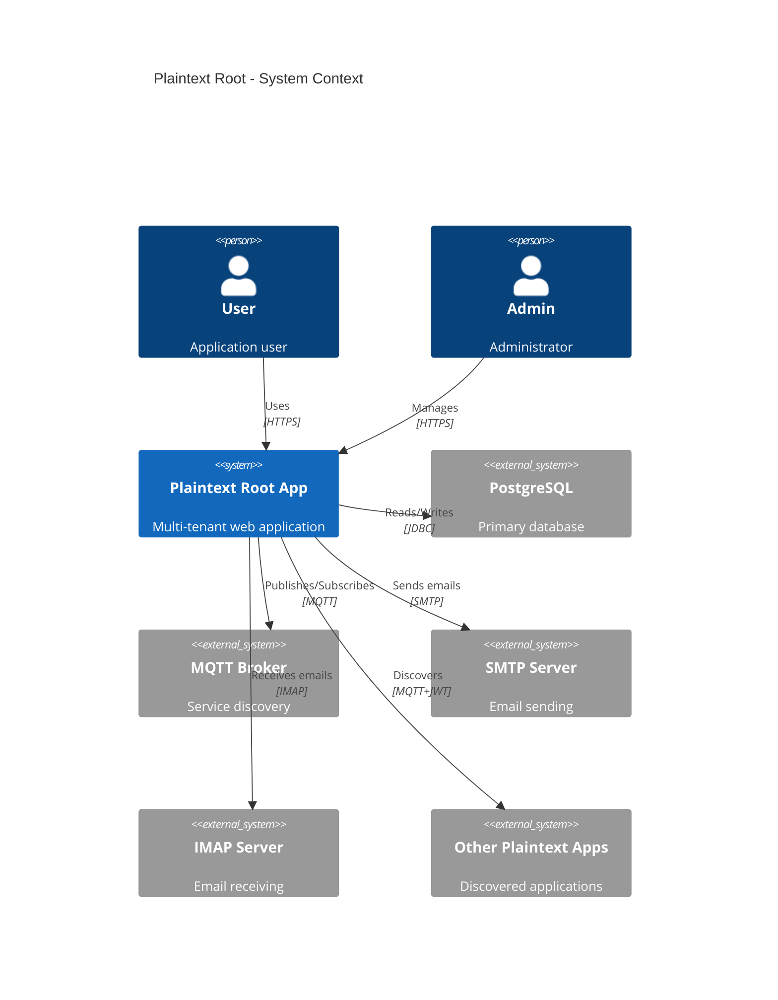
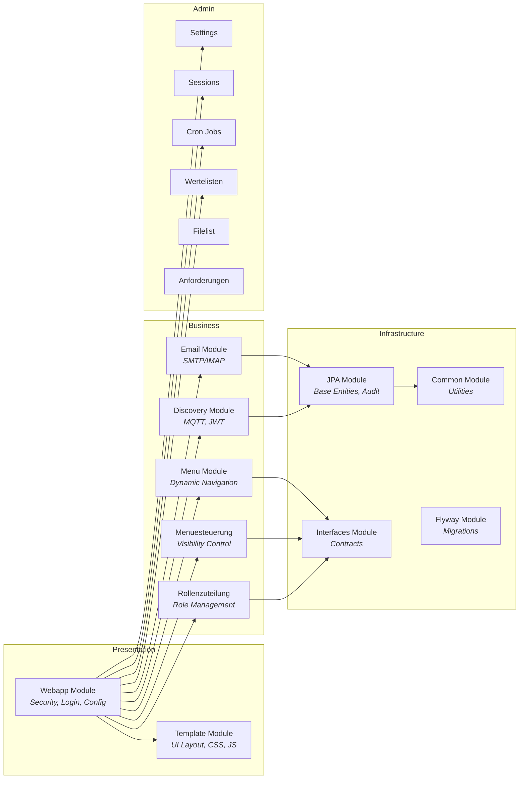
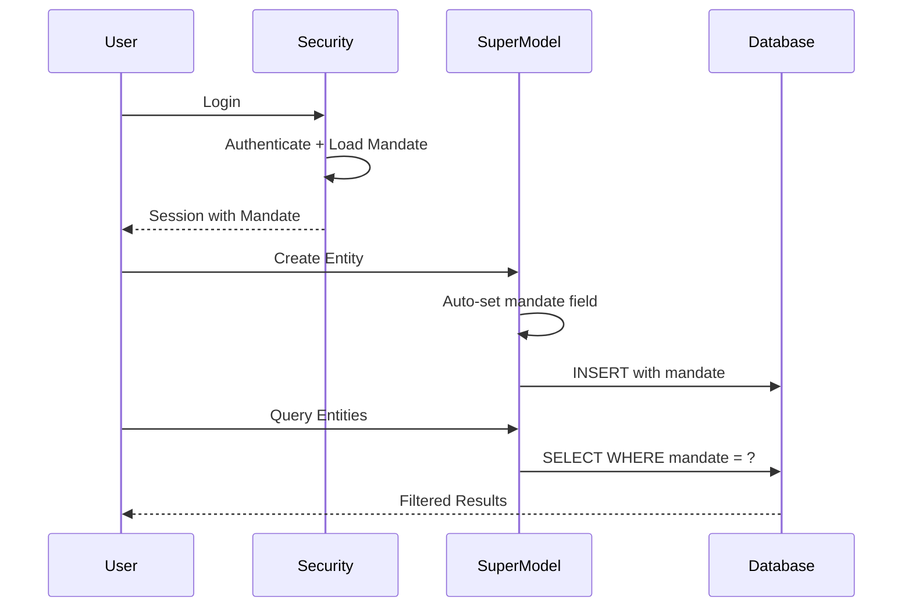
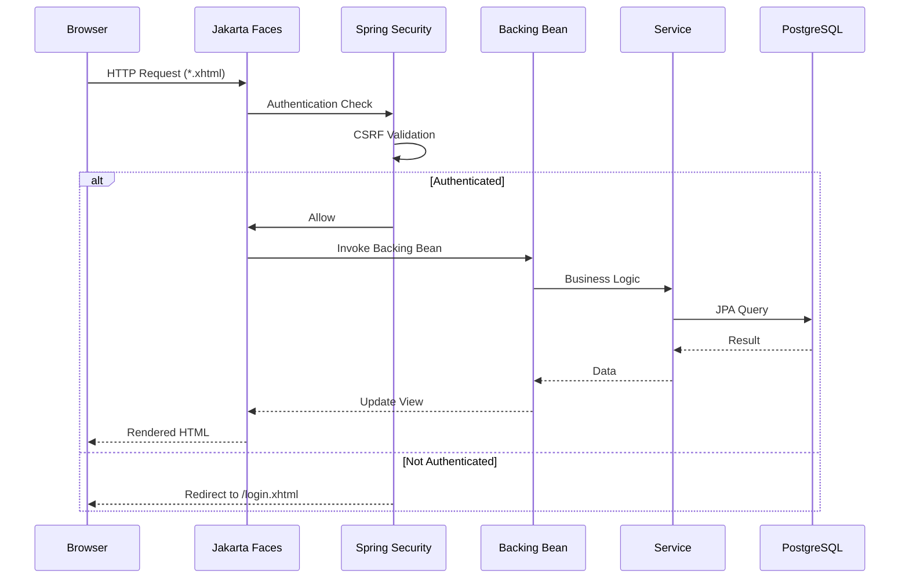
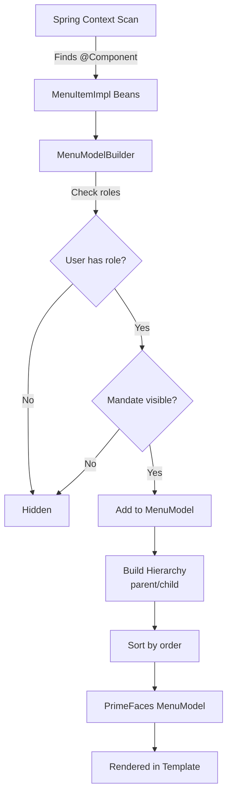
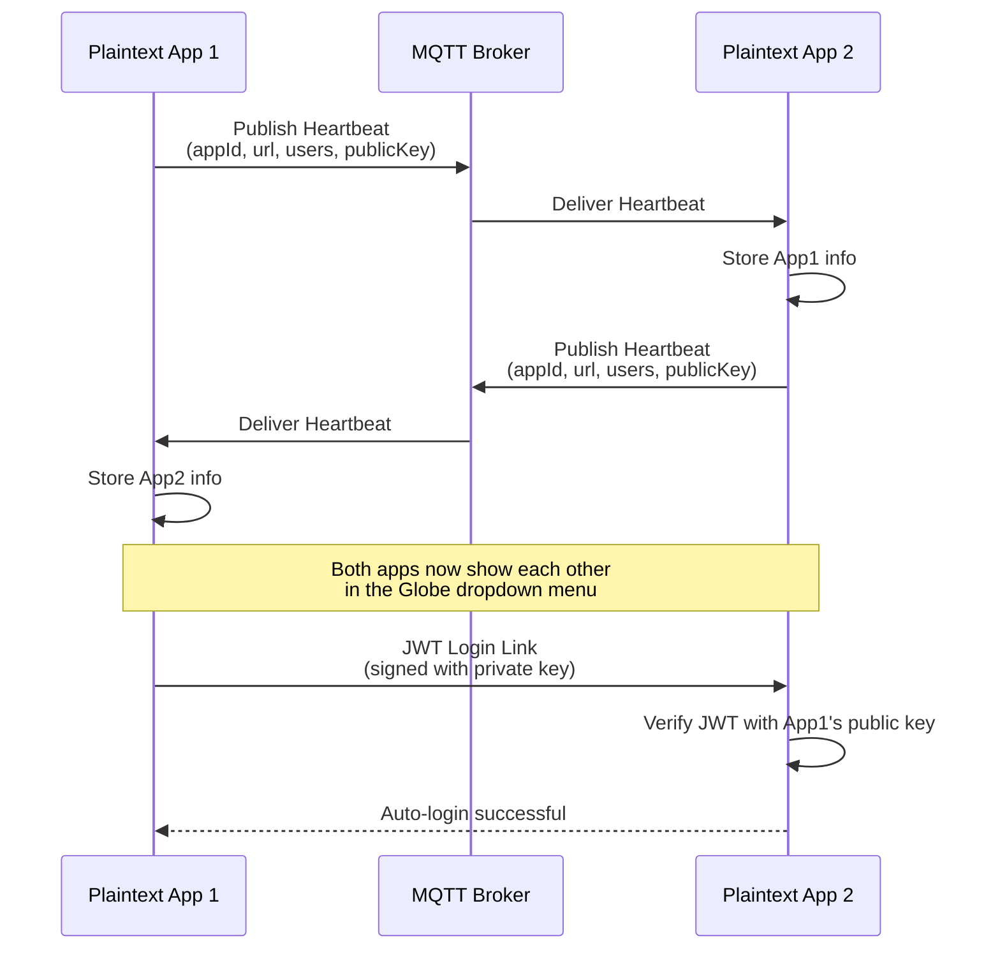
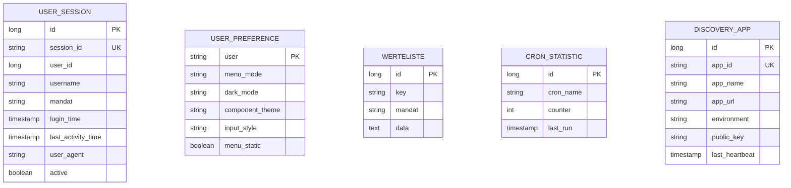
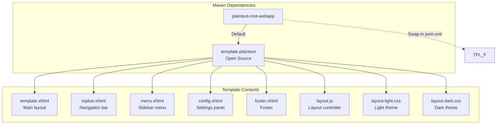
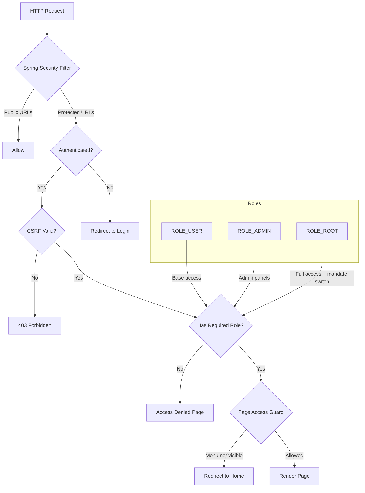
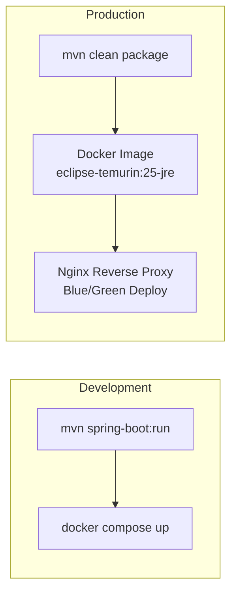

# Architecture Documentation

## Overview

Plaintext Root is a modular Jakarta Faces (JSF) application framework built on Spring Boot. It provides a complete foundation for building multi-tenant web applications with pre-built admin functionality, security, and a pluggable template system.

## System Architecture

## Module Architecture

## Multi-Tenancy Architecture

Every entity extending `SuperModel` automatically:
- Gets `mandat` field set on creation
- Gets `createdDate` and `lastModifiedDate` audit fields
- Can be filtered by mandate for data isolation

## Request Flow

## Menu System

Menu items are:
1. Discovered via Spring component scanning
2. Filtered by user roles
3. Filtered by mandate visibility
4. Organized into parent/child hierarchy
5. Sorted by order property
6. Rendered via the template's menu component

## Discovery System

## Database Schema (Core)

## Template System

Templates are swapped by changing a single Maven dependency. Both templates provide identical file paths under `META-INF/resources/`, so no code changes are needed in consuming applications.

## Security Architecture

## Deployment

The project includes:
- `compose.yaml` for local development (PostgreSQL)
- `Dockerfile` for production container builds
- `deploy/docker-compose-bluegreen.yaml` for blue/green deployments with Nginx
